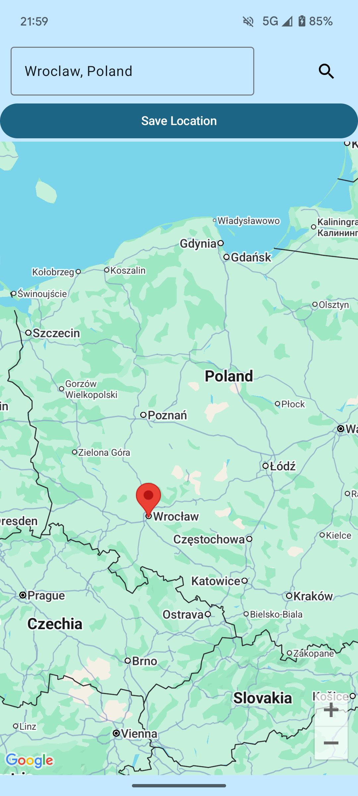
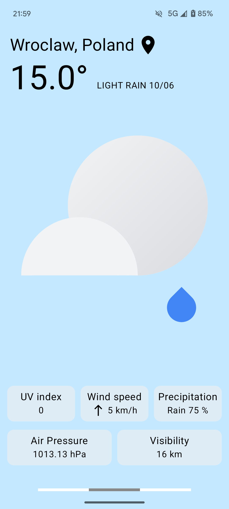
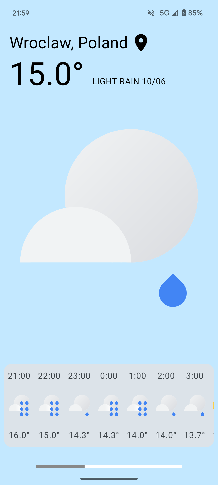
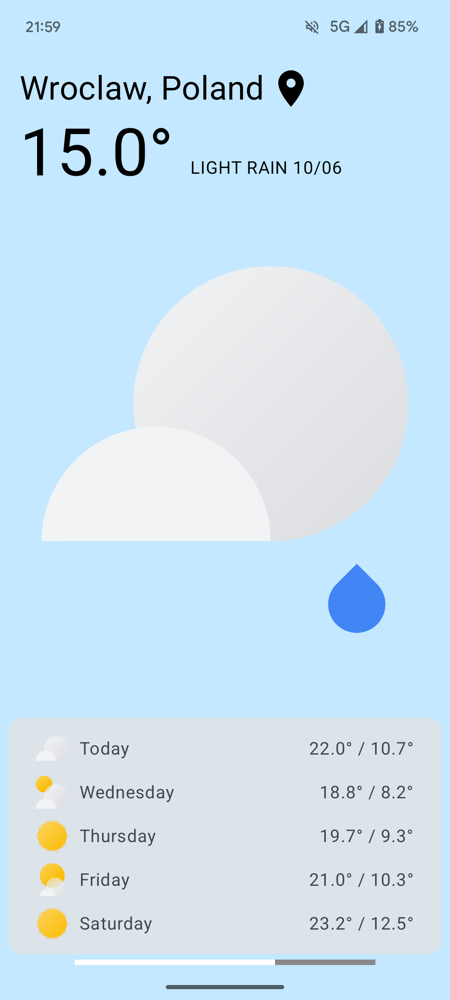

# WeatherApp 🌤️

A dynamic android application that fetches and displays current weather and forecast information for any location using external weather APIs.

## Features

- Interactive search: Find the weather by typing a city name or by clicking directly on the map.

- Current weather details: View comprehensive real-time data, including:

  - Temperature

  - Wind speed and direction

  - Atmospheric pressure

  - Visibility

  - UV index

  - Precipitation (rain/snow, if present)

- 24-hour forecast: See how the temperature changes throughout the day, hour by hour.

- 5-day forecast: A simple daily forecast with temperature trends for the upcoming days.

## Demo

  <figure style="display: inline-block; margin: 10px;">
    
    <figcaption>Map search</figcaption>
  </figure>
  <figure style="display: inline-block; margin: 10px;">
    
    <figcaption>Current weather</figcaption>
  </figure>
  <figure style="display: inline-block; margin: 10px;">
    
    <figcaption>24-hour forecast</figcaption>
  </figure>
  <figure style="display: inline-block; margin: 10px;">
    
    <figcaption>5-day forecast</figcaption>
  </figure>

[Download APK](https://github.com/kkateryna06/WeatherApp/releases/tag/demo)

## Technologies
- Kotlin + Coroutines

- Google Maps SDK

- Retrofit (Weather API)

- MVVM Architecture

## Usage

1.  Search for a location

You can either type the name of a city or simply tap on any location on the map

2.  View weather information

The app displays current weather conditions, including temperature, weather description, humidity, wind speed/direction, pressure, visibility, UV index, and precipitation.

3.  Swipe between views

At the bottom of the screen, swipe left or right to switch between:
  - Current weather
 
  - 24-hour forecast

  - 5-day forecast

## Configuration
API endpoints used:

- Current weather: v1/currentConditions:lookup

- Weekly forecast: v1/forecast/days:lookup

- Hourly forecast: v1/forecast/hours:lookup

Base url: https://weather.googleapis.com/
